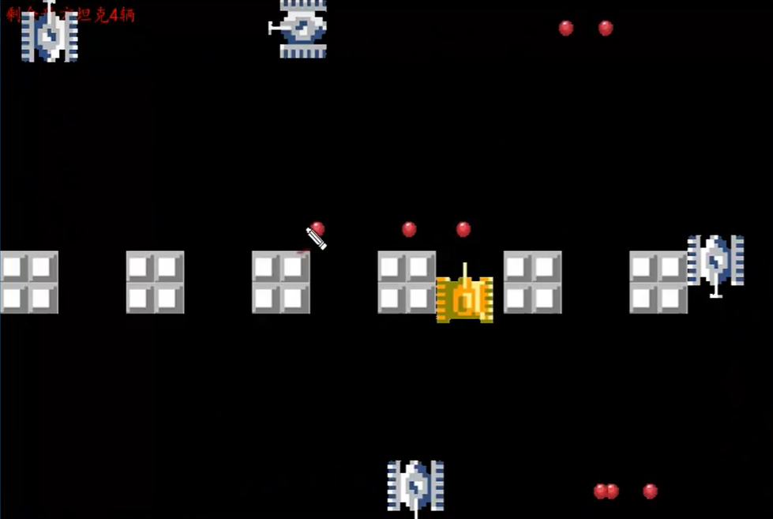

# TankWar

[TO]

#### 一、初始化类



###### 坦克类：敌我坦克

1、射击

2、移动类

3、显示坦克的方法

###### 子弹类

1、移动

2、显示子弹的方法

###### 墙壁类

1、属性：是否可以通过

###### 爆炸效果类

1、展示爆炸效果

###### 音效类

1、播放音乐

###### 主类

1、开始游戏

2、结束游戏


#### 二.加载主窗口

（代码：def start_game）

游戏功能查询：www.pygame.org

import pygame

常用功能：

1.主窗口显示：pygame.display (set_mode设置screen，fill填充颜色)

#### 三.事件处理

（代码：def getEvent)

任务：关闭窗口及实现键盘对游戏的操控

2.获取事件： pygame.event.get()

3.按下按键：event.type == pygame.KEYDOWN

4.关闭游戏：event.type == pygame.QUIT

#### 四.界面内文字提示

(代码： def getTextSurface)

5.字体模块：pygame.font

6.图像：pygame.Surface.blit 将一个图像绘制到另一个上方

#### 五.加载我方坦克

7.图像传输模块：pygame.image

(代码：class Tank：init，display)

使用字典存坦克四个方向的照片 pygame.image.load(文件名)

8.用于存储直角坐标的pygame对象：pygame.rect

#### 六.我方坦克移动及转向

（代码：def move）

计算屏幕边界值防止坦克移出边界，通过top和left两个变量来确定四个方向边界范围

#### 七.使坦克在按下键时持续移动

(代码：def getevent)

key_up,key_down键来开始和停止坦克移动

添加新属性 stop作为坦克移动开关，控制转向后可以继续移动

import time模块，使用time.sleep来使坦克移速慢一点

注意：上下左右方向键会影响坦克移动，但是空格键（发射子弹）和移动键应该可以同时

#### 八.加载敌方坦克

(class EnemyTank，初始化加载坦克图片)

敌方坦克特点： 数量为多个，游戏开始时敌方坦克位置及方向具有随机性

（代码：import random --- def randDirection 用于生成初始随机坦克方向)

根据随机生成数（1-4）来决定方向，从而获取相应的图片

在maingame模块中定义两个类变量存储敌方坦克列表和数量，在maingame中定义一个方法 def createEnemyTank(), 循环生成敌方坦克，定义方法def blitEnemyTank 通过遍历敌方坦克列表循环展示敌方坦克

#### 九.敌方坦克移动

更改敌方坦克剩余个数统计文字, 优化敌方坦克走到边界继续改变方向移动

（代码： def blitEnemyTank）循环遍历敌方坦克展示

增加step变量来修改坦克移动方向（Class EnemyTank def randMove）

#### 十.子弹类初始化

代码：class Bullet 

针对不同方向，使用坦克和子弹高度宽度计算在各个方向子弹可活动边界值

#### 十一.我方发射子弹

建mybulletlist，使用空格键进行调试，（代码：def blit_my_bullet）

优化：1.子弹碰到墙壁应该消失（使用live变量） 2.子弹应有个数限制（用列表）

#### 十二.敌方发射子弹

代码：def blit_enemy_bullet

#### 十三.我方子弹与敌方坦克碰撞

方法：精灵类：sprite类

定义一个基类 class BaseItem（Sprite）

定义方法：def mybullet_hit_enemy

```
在EnemyTank中定义super(EnemyTank,self).__init__(left,top,windows)
```

#### 十四.爆炸类
